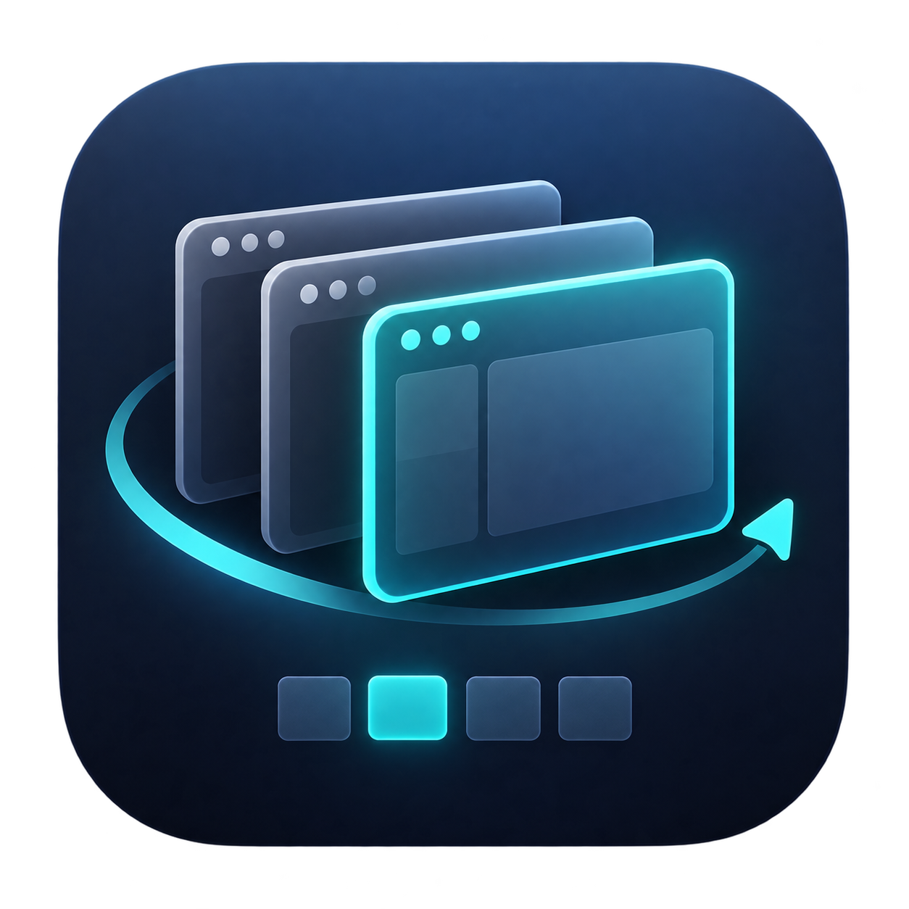

<p align="center"></p>

# DeskPilot

A native macOS desktop manager built with Swift, SwiftUI and AppKit. Give each app and Chrome profile a place, name your desktops, and save window layouts for your displays.

## Features

- **Automatic desktops.** An unassigned app or Chrome profile gets a newly created macOS desktop. Its other windows join the same desktop; reopening it reuses the saved assignment while that desktop exists.
- **Names that make sense.** Desktops use their assigned app or Chrome profile name. Choose a custom name with the pencil or the desktop context menu, or switch back to automatic naming. Optional badges show these names on Mission Control thumbnails.
- **Chrome profiles.** Match profiles by their stable profile directories and the profile information exposed by Chrome's native accessibility window title. Windows belonging to different profiles are kept separate.
- **Shared desktops.** Add another app to a desktop and place windows on the left or right half of the display.
- **Display layouts.** Save assignments and window geometry for a display setup. Restore a matching layout when displays change, with a default layout for one display.
- **Native integration.** Keep macOS Spaces, Mission Control, gestures and manual desktop ordering. Access DeskPilot from the Dock, menu bar or keyboard.
- **Event-based updates.** Window and workspace events trigger reads. Startup retries are bounded; unresolved live windows can resume when their title or profile information changes.

Custom desktop names appear in DeskPilot, the menu bar and optional Mission Control badges. The badges are a click-through visual overlay; Apple's underlying system labels are unchanged. No separate naming permission is needed.

**Settings → Show names in Mission Control** controls the badges and is enabled by default. WindowManager and Dock events wake the detector, with a fallback check every 1.5 seconds while idle and geometry updates every 0.25 seconds while Mission Control is visible. Disabling the feature stops these checks. Badges use the exposed thumbnail geometry and Space identities; if the thumbnail list changes or geometry is unavailable, names are hidden instead of placed by guesswork. Empty, unnamed desktops and fullscreen apps do not receive badges.

On macOS 27, Mission Control discovery reads WindowManager first and falls back to the Dock; earlier systems use the opposite order. An empty `mc` group is ignored. A display is matched by its native ID or a unique full-screen geometry match when the ID is absent. This shared discovery is used by desktop creation, switching, routing guards and name badges. The macOS 27 hierarchy change is documented in this [compatibility report](https://github.com/Hammerspoon/hammerspoon/issues/3897).

## Build

Requirements: an Apple Silicon Mac, macOS 14 or later, and Apple Command Line Tools.

```sh
sh build.sh
sh test.sh
open .build/DeskPilot.app
```

The build produces `.build/DeskPilot.app`, including standard and Retina icon sizes. The source is organized into `Sources/`, `Tests/`, `Resources/` and `ThirdPartyNotices/`.

## Set up

1. Open DeskPilot and choose **Grant access**. On macOS 27, enable the app in **Privacy & Security → Device Control and Data Access**. Earlier macOS versions call this permission **Accessibility**. Return to DeskPilot to check access.
2. In **System Settings → Desktop & Dock**, disable automatic Space reordering and enable **Displays have separate Spaces**.
3. Choose **Enable automation** to assign your open standard windows and handle new windows automatically. **Organize now** runs the same assignment rules on demand.
4. Use **Add app** to share a desktop. Use the window menu or keyboard shortcuts to arrange windows side by side.
5. Save a layout for your laptop and mark it as the single-display default. Save another layout with external displays connected.

Closing the panel keeps DeskPilot running. **Quit DeskPilot** or **Command-Q** terminates the app. Only one instance can manage the same settings directory. Opening a different copy while one is running shows its version and location instead of silently appearing to launch the new copy.

Local builds use an ad hoc signature by default, so a rebuild can invalidate macOS privacy permissions. For repeated development builds, set `DESKPILOT_SIGNING_IDENTITY` to the name or hash of your existing code-signing identity and keep using the same certificate. This build option does not create a certificate or change privacy settings. If window access stops working after a rebuild, remove the existing permission entry and add the exact application you are running. **Show this app in Finder** identifies that file. Chrome catalog access is separate from window management access.

## Keyboard shortcuts

| Shortcut | Action |
| --- | --- |
| Control–Option–Space | Show or hide the panel |
| Control–Option–1…9 | Switch desktop |
| Control–Option–Shift–1…9 | Assign the focused app or Chrome profile to a desktop |
| Control–Option–Left / Right | Place the focused window on the left or right half |
| Control–Option–P | Pause or resume automation |
| Command-Q | Quit while DeskPilot is focused |

Desktop numbers follow the current display and Space order. Assignments and names follow the Space's identity when it is reordered or moved to another display.

## Chrome profile matching

DeskPilot reads profile names and directory identifiers from Chrome's local profile catalog. Before reading Chrome's windows, it queries the application's accessibility role. Chromium uses this request to initialize its native accessibility interface; reading the window list alone can leave profile information unavailable. DeskPilot then checks the window and its native root containers, with a depth and node limit. It does not request VoiceOver mode or descend into page content, tabs or toolbars. With one regular Chrome profile, Chrome can omit the profile suffix; DeskPilot handles that case. Profile names with Unicode formatting or nonbreaking spaces are normalized before matching.

Incognito, guest windows, duplicate profile names and conflicting identity information are not assigned by guessing. If Chrome does not expose enough information, use **Choose profile…**. An explicit choice takes priority for that window and immediately queues it for assignment when automation is enabled. No tabs are detached, and page contents are not traversed to identify a profile.

Names are matched according to Chromium's [accessible window title](https://chromium.googlesource.com/chromium/src/+/main/chrome/browser/ui/views/frame/browser_view.cc) and [native accessibility activation](https://chromium.googlesource.com/chromium/src/+/main/chrome/browser/chrome_browser_application_mac.mm) behavior. Matching and routing regressions are covered by local tests with synthetic windows and profiles. Diagnostics shows separate counts for profiles in the catalog, native Chrome windows found, and windows with a known profile. Browser tabs are not counted as profiles.

If the catalog cannot be read, Diagnostics shows **Unavailable** and the actual file error, rather than claiming there are zero profiles. Choose **Connect Chrome profiles…** and select `~/Library/Application Support/Google/Chrome/Local State` in the system file picker. The picker is attached to the app window, and Diagnostics distinguishes waiting, cancellation, selection failure and success. DeskPilot validates the catalog before replacing a previous connection and saves a file bookmark for future launches.

DeskPilot retains only profile names and directory identifiers already read with permission, never the full catalog. If a later read fails, these entries are marked **saved**; matching then requires an explicit profile suffix or a manual choice. It never assumes a sole saved profile is Chrome's only current profile. An unavailable saved bookmark requests reconnection instead of silently reading a different catalog. Failed reads are retried at most every 30 seconds when window events occur, and **Refresh and check access** retries immediately. Discovery runs even when macOS temporarily fails to expose its desktops.

The app includes Apple's [other-application-data purpose message](https://developer.apple.com/documentation/bundleresources/information-property-list/nsappdatausagedescription) to explain its use of profile metadata when macOS asks for access. The purpose message does not grant access or repair a permission invalidated by a changed code signature.

**Refresh and check access** updates the local runtime report with counts, file-read status and event types, without page titles or URLs. Completed operations and automation toggles also write their result, pause reason and last detected Mission Control host. Activating DeskPilot's own panel is excluded from managed-window events.

## Reliability and privacy

- A desktop assignment is saved only after macOS confirms the window's destination.
- A failed automatic creation or movement pauses automation and preserves the reason across panel activation and app restart. Enabling automation explicitly clears the previous reason. Retrying a failed move reuses the desktop already created in that session.
- Late native window IDs, delayed Chrome titles and windows created while another operation is running stay queued until they can be processed.
- Saved names take priority over temporary window titles. Clearing a custom name restores the app or profile name.
- Settings stay on this Mac. No screenshots are captured and no network service is used by the app. Layouts store window-title hashes rather than full titles or tab URLs.
- Settings are stored in `~/Library/Application Support/DeskPilot Native/state.json`. Invalid settings files are preserved rather than overwritten.

## Verification and limitations

Version 0.2.4 is a development build. See [VERIFICATION.json](VERIFICATION.json) for the exact checks and remaining manual tests.

The local suite includes policy tests and tests of the real routing engine against a simulated desktop service. It covers desktop creation, app and Chrome grouping, late metadata, busy queues, failure recovery and automatic/custom names. These tests do not substitute for a live multi-display test.

Space management uses private macOS functions and Accessibility. Compatibility must be checked after macOS updates. Standard windows and regular desktops are managed; native fullscreen and windows on all Spaces are excluded. Closed documents and tabs are not recreated. Desktops are never automatically deleted.

Useful diagnostics:

```sh
.build/DeskPilot.app/Contents/MacOS/DeskPilotNative --diagnose
.build/DeskPilot.app/Contents/MacOS/DeskPilotNative --verify-move
```

`--diagnose` only reads system capabilities. `--verify-move` creates its own temporary window, moves it between two existing regular desktops, checks the destination and return, then closes it. It requires window management access. A tool-launched diagnostic process can have a different permission context from the normally opened app; verify access in the actual app as well.

`--data-dir /path` isolates settings for development. `--background` starts with the panel hidden, and `--smoke` exits after three seconds.

Third-party attribution and license notices are retained in [ThirdPartyNotices](ThirdPartyNotices).
